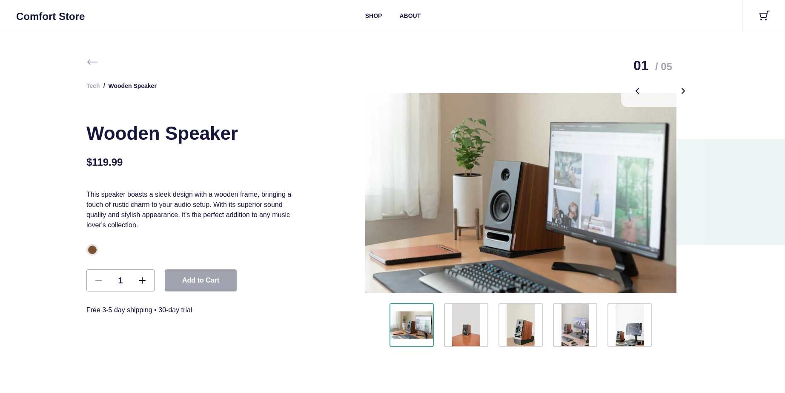
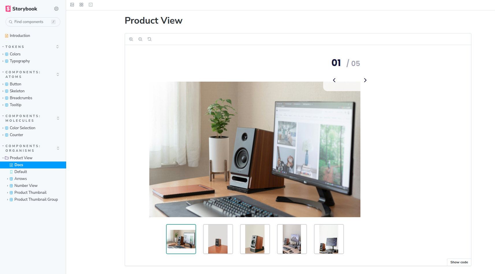

# Comfort Store

It is an eCommence application developed as a pet project.
> :bulb: Comfort Store is **deployed**! Follow the link: **https://comfort-store-xi.vercel.app**

- There is a [Product Page](https://comfort-store-xi.vercel.app/products/1) with interactive view of product's photos.
- Information about a product is fetched from a server. Read more [in this section](#backend).
- Components are documented in Storybook. Read more [in this section](#storybook).

## Deploy

This application in deployed at Vercel, you can explore it here: https://comfort-store-xi.vercel.app

## Storybook

The components of this appication were developed in isolation and documented using Storybook!

You can explore documentation here:
https://comfort-store-storybook.vercel.app/

## Backend

The backend server is built using Next.js and uses a .json file as a database.

Its endpoints: https://comfort-store-xi.vercel.app/api/

## Tools&Technologies

Main technologies:
- **[Next.js](https://nextjs.org/)** [(React)](https://react.dev/)
- **[TypeScript](https://www.typescriptlang.org/)**
- **[SASS/SCSS](https://sass-lang.com/)**

I have also used:
- [SWR](https://swr.vercel.app/) for data fetching
- [Storybook](https://storybook.js.org/) for documentation
- [Vercel](https://vercel.com/) for deploy
- [Eslint](https://eslint.org/) & [Prettier](https://prettier.io/) for code linting and formatting
- [npm](https://docs.npmjs.com/about-npm) as a package manager
- [Node.js](https://nodejs.org/en) as a runtime environment
- [git](https://git-scm.com/) & [GitHub](https://github.com/) for version control

## Sources

- **Design** is based on [Furniture Store | E-commerce Freebie](https://www.figma.com/community/file/1208280589750649537/furniture-store-e-commerce-freebie?searchSessionId=lsirmycq-x512xe3y3pj) by **[Huzefa Bagwala](https://www.figma.com/@huzefab)** on Figma Community
- The products' **photos** used in this application are by **[Behnam Norouzi](https://unsplash.com/@behy_studio)** on Unsplash
